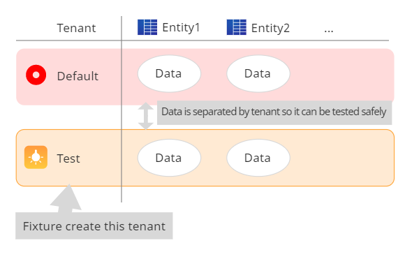
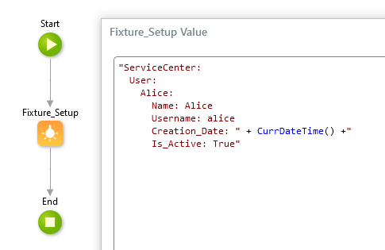
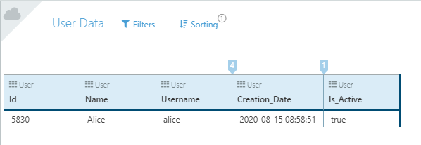
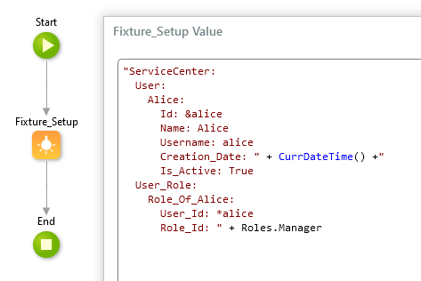
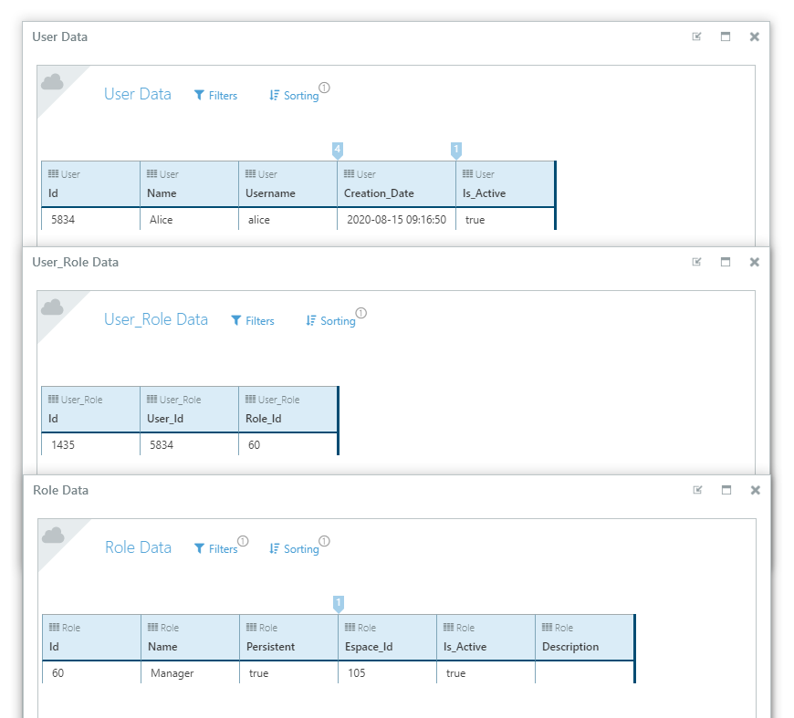

# Fixture

## What does this component do?

This component is a test fixture for OutSystems. It makes it easy to create a tenant for testing and register/discard test data.

## Detailed description

Fixture will automatically create a tenant for testing. Test tenants are created using the platform's [multi-tenant mechanism](https://success.outsystems.com/Support/Enterprise_Customers/Maintenance_and_Operations/How_to_Build_a_Multi-tenant_Application). Data for tenants for testing and other tenants are separated by the platform, so you can safely test without affecting or affecting other tenants. This also allows you to test in your development environment without having to deploy your application to a test environment.

Fixture also imports test data to the test tenant. Input the [YAML](https://yaml.org/) test data into the `Fixture_Setup` action. Please refer to the following usage sample and execution result.

Usage sample  

Execution result  

Because YAML is just text, you have the flexibility to create test data as follows:

- Use a function like `CurrDateTime()`
- Create dynamically by looping
- Use foreign key values with YAML [anchors and aliases](https://yaml.org/spec/1.2/spec.html#id2786196)

Anchor and alias usage sample  
Specify a value for `User_Role.User_Id` by using an alias to `User.Id`.  

Execution result  

## Actions

The following is a summary of the actions provided by this component. See the "Documentation" page for more information on actions.

- Fixture_Setup: Create test tenant and import test data
- Fixture_Teardown: Delete test data
