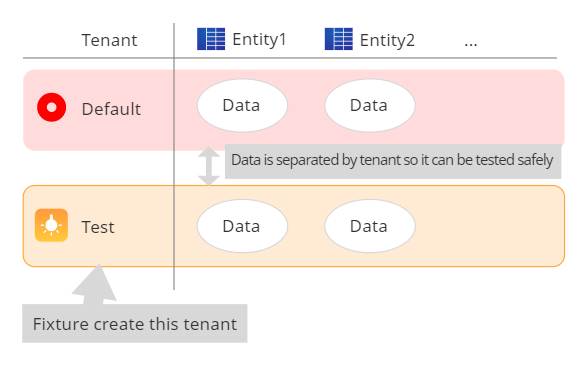
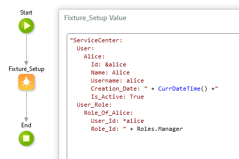
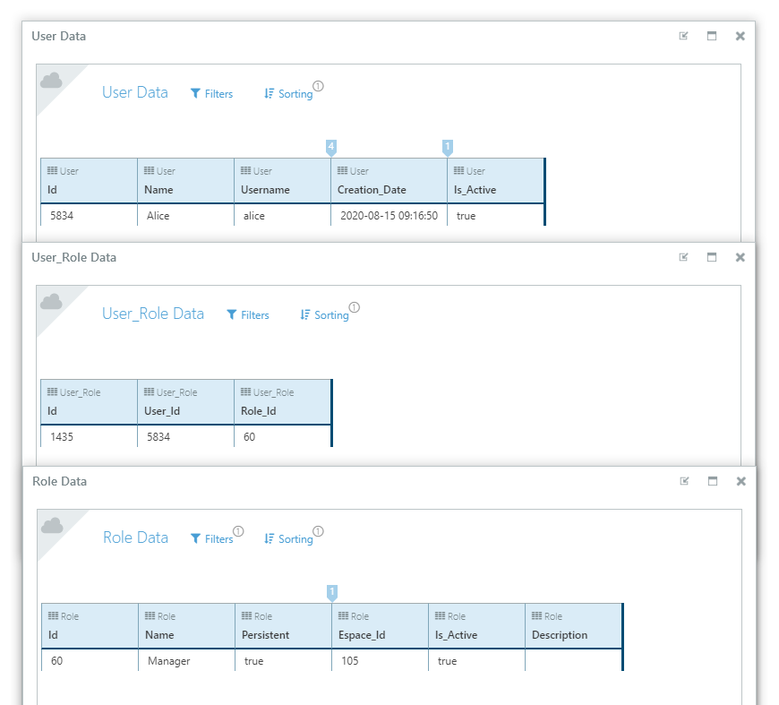

# Fixture

## このコンポーネントは何をしますか？

このコンポーネントは、OutSystems用のテストフィクスチャです。テスト用のテナント作成とテストデータ登録・破棄を簡単にします。

## 詳細な説明

Fixture はテスト用のテナントを自動で作成します。テスト用のテナントはプラットフォームの[マルチテナントメカニズム](https://success.outsystems.com/Support/Enterprise_Customers/Maintenance_and_Operations/How_to_Build_a_Multi-tenant_Application)を利用して作成します。テスト用のテナントと、それ以外のテナントのデータはプラットフォームによって分離されるため、それ以外のテナントに影響与えたり、影響を受けることなく安全にテストが行えます。これによって、テスト環境にアプリケーションをデプロイすることなく、開発環境でテストを行うことも可能となります。

テストテナントへテストデータのインポートも Fixture が行います。`Fixture_Setup` アクションに [YAML](https://yaml.org/) のテストデータをインプットします。次の使用サンプルと実行結果を参照してください。

使用サンプル  

実行結果  

YAML はただのテキストであるため、次のように柔軟にテストデータを作成することが可能です。

- `CurrDateTime()` のような関数を使用する
- ループ処理で動的に作成する
- YAML の[アンカーとエイリアス](https://yaml.org/spec/1.2/spec.html#id2786196)を用いて外部キーの値を使用する

アンカーとエイリアスの使用サンプル  
`User_Role.User_Id` に `User.Id` へのエイリアスを使用して値を指定します。  

実行結果

## アクション

このコンポートネントが提供するアクションの概要は次の通りです。アクションの詳細は "Documentation" のページを参照してください。

- Fixture_Setup : テストテナントの作成とテストデータのインポートを行う
- Fixture_Teardown : テストデータの破棄を行う
